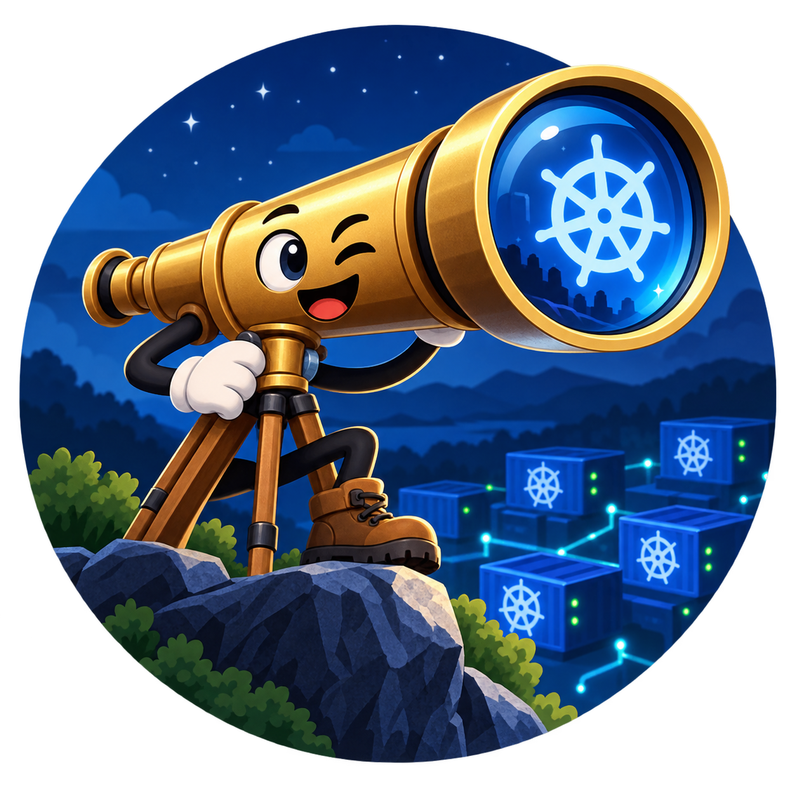

<p align="center">
  
</p>

# Fernrohr App

A Rust desktop application for Kubernetes cluster monitoring and resource browsing, built with GPUI and GPUI-Kit.

## About This Project

Fernrohr App is the desktop UI component of the Fernrohr meta-repository, providing developers with an intuitive interface to browse, inspect, and manage Kubernetes cluster resources.

## Building

### Prerequisites

- Rust 1.70+
- macOS 11+ (currently macOS-only)
- `ssh` on `PATH` - required to connect any kube context bound to an SSH tunnel; Fernrohr
  shells out to the system OpenSSH client rather than bundling its own
- For a command tunnel, the tool it runs (for example `gcloud`) on your login shell's `PATH`

### Build Commands

```bash
# Debug build
cargo build

# Release build
cargo build --release

# Run in development
cargo run

# Run tests
cargo test

# Run linting
cargo clippy -- -D warnings

# Format code
cargo fmt
```

## Running the App

The macOS `.app` and `.dmg` the Package workflow builds are ad-hoc signed, so Apple Silicon runs
the app and TCC can remember its local network permission. You no longer need to sign it yourself.

An ad-hoc signature carries no Developer ID and isn't notarized, though, so Gatekeeper still blocks
a copy downloaded through a browser: it reports the app as damaged or from an unidentified
developer. Once you have the app installed in `/Applications`, clear the quarantine flag:

```sh
xattr -d com.apple.quarantine "/Applications/Fernrohr.app"
```

Or open it once from System Settings → Privacy & Security → Open Anyway. Builds made before
signing landed still need `codesign --force --sign - "/Applications/Fernrohr.app"` as well.

## Installing on Linux

Each release has Linux packages for x86_64 and for arm64 (aarch64). Pick the one for your system:

| Package | For | Install |
|---|---|---|
| `.deb` | Debian, Ubuntu and derivatives | `sudo apt install ./fernrohr_<version>_amd64.deb` (`_arm64.deb` on arm64) |
| `.rpm` | Fedora, RHEL and derivatives | `sudo dnf install ./fernrohr-<version>-1.x86_64.rpm` (`.aarch64.rpm` on arm64) |
| AppImage | Any distribution, without installing | `chmod +x fernrohr_<version>_x86_64.AppImage`, then run it |

The `.deb` and `.rpm` bring in what Fernrohr needs at run time:

- **`openssh-client`** (`openssh-clients` on Fedora): Fernrohr runs `ssh` for SSH tunnels.
- **`libsecret`**: Fernrohr stores tunnel keys and other credentials through the Secret Service.
  A Secret Service provider has to be running for that, so the packages recommend one
  (`gnome-keyring`, KWallet or KeePassXC). Most desktops already run one, and it can be any of
  them.

The AppImage bundles `libsecret` but can't install anything, so the host needs `ssh` on its `PATH`
and a running Secret Service provider.

### Verifying a download

Each release also has a `SHA256SUMS` file. Download it into the same directory as the package,
then check the package against it:

```sh
sha256sum --check --ignore-missing SHA256SUMS
```

The package's line should end in `OK`. `--ignore-missing` skips the other packages listed in the
file that you didn't download.

## Keyboard

Every action is a command in the command palette (⌘⇧P), and you can change any command's key in
Settings → Keyboard Shortcuts or in `keymap.toml` in the app's preferences folder.

Some shortcuts take two keys, such as `⌘K ←` to split a panel group. After the first key, the
status bar shows the keys so far, such as `⌘K …`, and above it the keys that would finish a
shortcut there, each with what it does. Press one of those keys to run it. Any other key, or a
change of focus, cancels the shortcut.

If the keys so far are a shortcut on their own as well as the start of a longer one, Fernrohr waits
for the next key before it runs the shorter shortcut. Set how long in Settings → Shortcut Timeout,
from 1 to 10 seconds (3 by default), or as `shortcut_timeout_secs` in `ui.toml`. A first key that
isn't a shortcut on its own, like `⌘K`, waits for its next key however long you take.

## Shells

`s` on a running pod, in the Pods panel or a pod's detail panel, opens a shell in its container,
asking which when it runs more than one. The shell is a real terminal (a Kubernetes exec with a
TTY), so full-screen programs like `top` and `vi`, Tab completion and Ctrl-C work as they would
locally, and the shell is resized with its panel. It uses the app's code font, text size and
colours.

While the terminal has focus it takes every key except the app's `⌘` shortcuts: copy (`⌘C`) and
paste (`⌘V`) - `Ctrl-Shift-C` and `Ctrl-Shift-V` on Linux - the command palette (`⌘⇧P`), and panel
and tab navigation. Scroll back through earlier output with the mouse wheel, and select it with
the mouse to copy it. When the shell exits, the panel says how it ended, and its screen and
scrollback stay to read and copy.

## Tunnels

A kube context can be bound to a tunnel, so Fernrohr reaches its cluster through it. Manage
tunnels in the Tunnels window (Context → Manage Tunnels…). Bind a context to one with Set Tunnel
for Context, or with the tunnel selector on the context's row in the cluster picker. A tunnel is
one of three kinds.

- **SSH tunnel**: Fernrohr runs `ssh -N -L` through a bastion to the context's API server.
- **Command tunnel**: Fernrohr runs a command you give it, such as a vendor CLI that opens an SSH
  session through an identity-aware proxy, and keeps it running while a bound context is
  connected. For example:

  ```
  gcloud compute ssh <bastion-host> --tunnel-through-iap --project <project> \
      -- -N -L{port}:127.0.0.1:8888
  ```

  `{port}` becomes the local port Fernrohr picks. If the command must use a fixed port instead,
  write that port into the command and set it as the tunnel's local port. The command runs
  without a shell, so pipes and `$VARIABLES` don't apply. Fernrohr looks it up on your login
  shell's `PATH`, even when it was opened from the Dock.

  Choose what the local port offers:
  - **Proxy** (the default): an HTTP proxy, as in the example, where port 8888 on the bastion
    is a proxy. Bound contexts keep their API server address and send their traffic through it.
  - **Forward**: the API server itself. Bound contexts connect to the local port instead.

  All contexts bound to a command tunnel share one running command. Test runs the command until
  it is ready, then stops it, and shows the command's output if it fails. The command must run
  unattended, so run it once in a terminal first to answer any host-key or login prompts. It is
  stored in plain text in `tunnels.toml`: leave credentials to the tool's own login, not flags.

- **Manual tunnel**: Fernrohr starts nothing. Use it for a cluster you can only reach after
  bringing up a network path by hand, such as a VPN from a menu-bar client with no command line.
  When a context bound to it connects, Fernrohr holds that connection and asks you to bring the
  path up, then waits for your answer, with no timeout:
  - **Proceed** connects every context waiting on the tunnel.
  - **Cancel** fails them, saying you cancelled it. Fernrohr never connects them directly
    instead.

  A manual tunnel has two settings:
  - **Instruction** (optional): shown in every prompt, for example "Connect the corporate VPN
    from the menu bar".
  - **When the API server already answers**:
    - **Skip the prompt** (the default): before asking, Fernrohr tries a quick connection to
      the context's API server and goes straight through if it answers. Choose
      **Always prompt** for an API server that answers without your VPN too.

  You are asked in three places:
  - a desktop notification;
  - the waiting context's capsule in the status bar, filled in the warning color, with Proceed
    and Cancel in its menu;
  - the cluster picker's status line, while it is connecting that context.

  From the keyboard, Proceed with Manual Tunnel (⌘⌥P, Ctrl+Alt+P off macOS) and Cancel Manual
  Tunnel (⌘⌥C, Ctrl+Alt+C) answer it. Both are in the command palette and can be rebound in
  `keymap.toml`. When several tunnels are waiting, they ask which one.

  Every context bound to the same manual tunnel shares one prompt. A context that connects
  while the tunnel is already confirmed and in use goes straight through. Once the last context
  using it disconnects, or a connection through it fails, the next connection asks again. Other
  contexts keep working while one waits.

  On macOS, a development build run with `cargo run` has no app bundle, so the system may not
  show its notifications. The status bar and the picker still ask.

## Agents (MCP)

Fernrohr is an [MCP](https://modelcontextprotocol.io) server, so a coding agent such as Claude
Code can use the clusters you have open in the app. The agent works through Fernrohr's own
connections, tunnels and permissions: it never sees your kubeconfig, credentials or tunnel
secrets, and it can only reach a context that a Fernrohr window has open, or one you let it
connect. Fernrohr has to be running for the agent to get an answer. It doesn't start the app on
the agent's behalf.

The agent can:

- **Read**: list contexts and whether each is connected, list a context's resource kinds, list
  and get resources, and read a pod's logs. Secret values come back as their sizes, never their
  contents. Large results are cut short and say so.
- **Navigate**: open or focus a resource list or an object's detail panel in the window holding
  its context, list your saved layouts, and load one in Add or Replace mode. A layout panel for a
  context the window isn't connected to comes back as a placeholder. Loading a layout never
  connects a context. Opening a panel or loading a layout brings Fernrohr to the front with that
  window focused, so you see what the agent is showing you. Reads and listing layouts never take
  focus.
- **Connect** a context from your kubeconfig, only with your approval: Fernrohr adds it to the
  frontmost window the way the status bar's add-context control does, or opens a window for it
  when none is open, and brings that window to the front. The agent is told within 20 seconds
  whether the context connected, is waiting for its tunnel, is waiting for you to confirm a manual
  tunnel, or failed, and otherwise that it is still connecting. A context the window already has
  is just brought to the front, without asking.
- **Act**, only with your approval, on this fixed list: set or remove one ConfigMap key, scale a
  Deployment, StatefulSet or ReplicaSet, restart or roll back a Deployment, StatefulSet or
  DaemonSet, pause or resume a Deployment's rollout, delete 1 to 10 named Pods, trigger a Job
  from a CronJob, and suspend or resume a CronJob. The agent can't create, edit, patch or delete
  anything else, and can't write Secrets.

### Approving actions and connections

Every action opens a confirmation in Fernrohr naming the action, context, namespace, kind and
every object it touches, with the values it changes, such as the replica count before and after,
a ConfigMap key's old and new value, or the revision a rollback returns to. To show those, the
action reads the objects first; nothing is written until you allow it.

- Rolling back and deleting Pods can't be undone, so their confirmation opens on Cancel and Enter
  cancels. Allow them by clicking, by tabbing to the button, or with `⌘⌫` (`Ctrl-Backspace` off
  macOS). Other actions can be allowed with Enter.
- Escape denies. A request you don't answer within 2 minutes is denied, and its dialog closes. It
  also closes if the agent stops waiting.
- The agent is told whether you allowed the action, denied it, or it timed out, and a denied or
  timed-out action sends nothing to the cluster.
- Requests are asked one at a time. A second waits until you answer the first.

Connecting a context asks too, naming the context and the tunnel it is bound to, with the
tunnel's kind, and saying the agent will be able to read it. Connecting changes nothing in the
cluster and disconnecting undoes it, so Enter allows it. A denied or unanswered request connects
nothing, and starts no tunnel or sign-in.

Reads and navigation need no approval.

### Setting up an agent

Open Settings → Agent Access. It has a ready-to-run command for Claude Code, Codex, Gemini CLI and
OpenCode, each with a copy button. From the keyboard, run **Copy MCP Setup Command** from the
command palette (⌘⇧P) and pick the agent. Each command registers Fernrohr for your user, so it
works in every project, and runs this installation's `fernrohr mcp` by its full path:

```
claude mcp add --scope user fernrohr -- '<path to fernrohr>' mcp
codex mcp add fernrohr -- '<path to fernrohr>' mcp
gemini mcp add --scope user fernrohr '<path to fernrohr>' mcp
opencode mcp add fernrohr --global -- '<path to fernrohr>' mcp
```

Older OpenCode releases lack `mcp add`, so the section also offers the config entry to paste into
`opencode.json`: under `mcp.fernrohr` in OpenCode 1.x, or `mcp.servers.fernrohr` in 2.x.

Copy the command from the running app rather than typing it, since the path is the one it is
running from. If that path won't last, the section explains why instead of offering a command:

- On macOS, an app opened straight from Downloads or a disk image runs from a temporary copy.
  Move Fernrohr to Applications and open it from there.
- A development build runs from Cargo's `target` directory, which the next build or
  `cargo clean` replaces. Install Fernrohr and open the installed app.

The connection between `fernrohr mcp` and the app is a Unix-domain socket in your per-user runtime
directory, readable only by you and checked against a token that changes every launch. It is never
a network port. Windows has no agent access yet, and the section says so.

## Development

See [CONTRIBUTING.md](CONTRIBUTING.md) for development workflow and contribution guidelines.

## License

See [LICENSE.md](LICENSE.md) for details.

## Code of Conduct

This project adheres to the [Contributor Covenant Code of Conduct](CODE_OF_CONDUCT.md).
